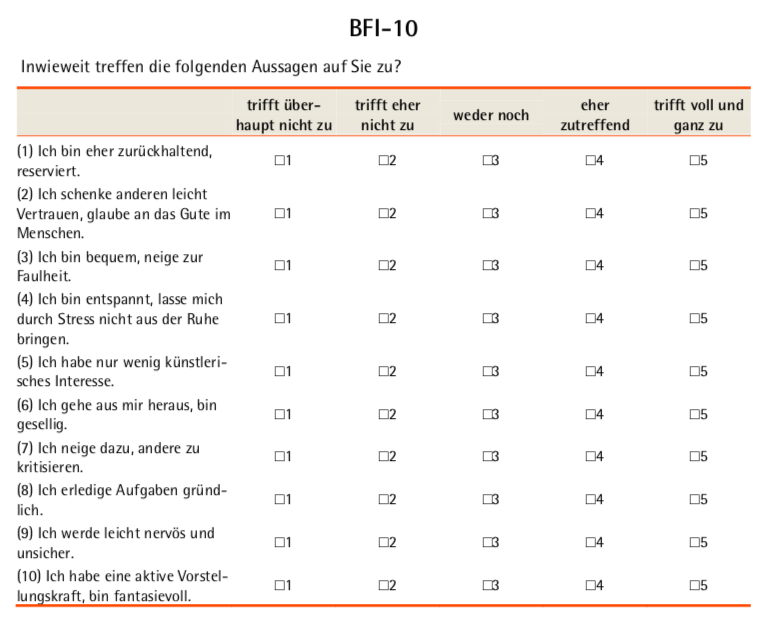

```{r setup, include=FALSE}
knitr::opts_chunk$set(echo = FALSE, eval = TRUE)
library(tufte)
# Umwandlung in Powerpoint-Datei über rmarkdown::render("BIG5_Einschaetzung-Fragebogen_article.Rmd", output_format = "powerpoint_presentation", output_options = list(reference_doc = "my-styles.pptx"))
# Umwandlung in Tufte-Handout über rmarkdown::render("BIG5_Einschaetzung-Fragebogen_article.Rmd", output_format = "tufte_handout")
# Umwandlung in Word-Datei über rmarkdown::render("BIG5_Einschaetzung-Fragebogen_article.Rmd", output_format = "word_document")
# Datei für Vortrag beidseitig ausdrucken
```


```{r fig.cap="Persönlichkeits-Fragebogen: Bitte nicht ausfüllen!"}

```


# Wie gut kennen mich ...?


```{r fig.cap="Einschätzung der eigenen Persönlichkeit durch Andere"}

```


