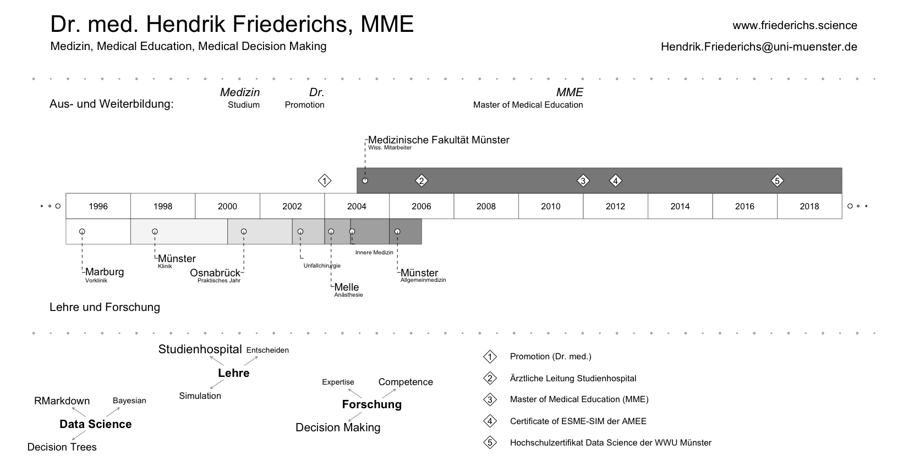

```{r setup, include=FALSE}
knitr::opts_chunk$set(echo = FALSE)
library(VisualResume)
```

# Visualisierter Lebenslauf

```{r VR_Bild, layout="l-screen-inset shaded"}

```


```{r VisualResume, layout="l-page", include=FALSE}
VisualResume::VisualResume(
  titles.left = c("Dr. med. Hendrik Friederichs, MME", "Medizin, Medical Education, Medical Decision Making", " "),
  titles.right = c("www.friederichs.science", "Hendrik.Friederichs@uni-muenster.de", " "),
  titles.left.cex = c(4, 2, 0),
  titles.right.cex = c(2, 2, 0),timeline.labels = c("Aus- und Weiterbildung:", "Lehre und Forschung"),
  timeline = data.frame(title = c("Marburg", "Münster", "Osnabrück", " ", "Melle", " ", "Münster", "Medizinische Fakultät Münster"),
                        sub = c("Vorklinik", "Klinik", "Praktisches Jahr", "Unfallchirurgie", "Anästhesie", "Innere Medizin", "Allgemeinmedizin", "Wiss. Mitarbeiter"),
                        start = c(1996, 1998, 2001, 2003, 2004, 2004.8, 2006, 2005),
                        end = c(1998, 2001, 2003, 2004, 2004.8, 2006, 2007, 2020),
                        side = c(0, 0, 0, 0, 0, 0, 0, 1)),
  milestones = data.frame(title = c("Medizin", "Dr.", "MME"),
                          sub = c("Studium", "Promotion", "Master of Medical Education"),
                          year = c(2002, 2004, 2012)),
  events = data.frame(year = c(2004, 2007, 2012, 2018),
                      title = c("Promotion mit dem Titel Epidemiologie und Verlauf der Migräne bei Patienten mit Multipler Sklerose", "Ärztliche Leitung Studienhospital", "Certificate of ESME-SIM der AMEE", "Hochschulzertifikat Data Science der WWU Münster")),
  interests = list("Data Science" = c(rep("RMarkdown", 10), rep("Decision Trees", 10), rep("Bayesian", 5)),
                   "Lehre" = c(rep("Studienhospital", 10), rep("Entscheiden", 3), rep("Simulation", 5)),
                   "Forschung" = c(rep("Expertise", 10), rep("Decision Making", 30), rep("Competence", 20))),
  col = c("#FFFFFF", "#F0F0F0", "#D9D9D9", "#BDBDBD", "#969696", "#737373", "#525252", "#252525"),
  year.steps = 2)
```


```{r table-publications}

# Liste der OrcID-Publikationen
# library(rorcid)
# (publications <- works(orcid_id("0000-0001-9671-5235")))

# knitr::kable(publications [2:20, 15], caption = "Publikationen Friederichs")
```


