```{r setup, include=FALSE}
knitr::opts_chunk$set(echo = FALSE, eval = TRUE)
# eval = TRUE um die eingefügten Bilder in die Präsentation einzufügen
library(tufte)
library(rmarkdown)
# Umwandlung in Powerpoint-Datei über rmarkdown::render("Mist_article.Rmd", , params = list(eval = TRUE), output_format = "powerpoint_presentation", output_options = list(reference_doc = "my-styles.pptx"))
# Umwandlung in Tufte-Handout über rmarkdown::render("Mist_article.Rmd", output_format = "tufte_handout")
# Umwandlung in Word-Datei über rmarkdown::render("Mist_article.Rmd", output_format = "word_document")
# Umwandlung in Shower-Präsentation über rmarkdown::render("Mist_article.Rmd", output_format = "shower_presentation")
# Umwandlung in Revealjs-Präsentation über rmarkdown::render("Mist_article.Rmd", revealjs_presentation(incremental = TRUE, theme = "black", transition = "fade", background_transition = "fade", highlight = "pygments"))
```
# Hintergrund

## Entwicklung des Internets
### Etablierung des Internets
Erreichen von 50 Millionen Nutzern weltweit

* Radio: fast 40 Jahre

* Fernsehen: 13 Jahre

* Personal-Computer (PC): 16 Jahre

* Internet: weniger als 5 Jahre ^[alles nach Spitzer M (2011) Aschenputtel als Flugsimulator (Editorial). Nervenheilkunde 30 (8): 545-554)]

### Zugriff auf das Internet: Wandlung von stationären zu mobilen Devices
... am Beispiel der Medizin

```{r fig.cap="Zugriff auf das Internet: Wandlung von stationären zu mobilen Devices"}

```

```{r fig.cap="Zugriff auf das Internet: Wandlung von stationären zu mobilen Devices"}
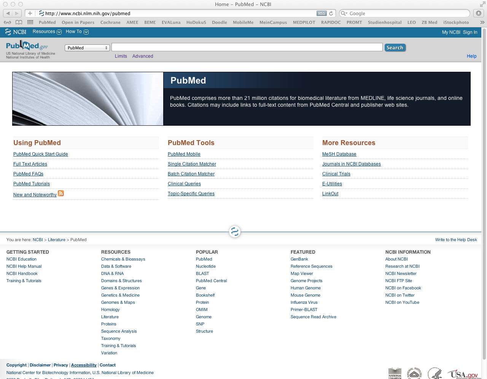
```

```{r fig.cap="Zugriff auf das Internet: Wandlung von stationären zu mobilen Devices"}
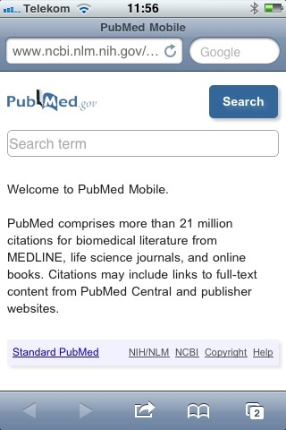
```

```{r fig.cap="Zugriff auf das Internet: Wandlung von stationären zu mobilen Devices"}
knitr::include_graphics("images/Unbound_am_Patientenbett.png")
```

```{r fig.cap="Zugriff auf das Internet: Wandlung von stationären zu mobilen Devices"}
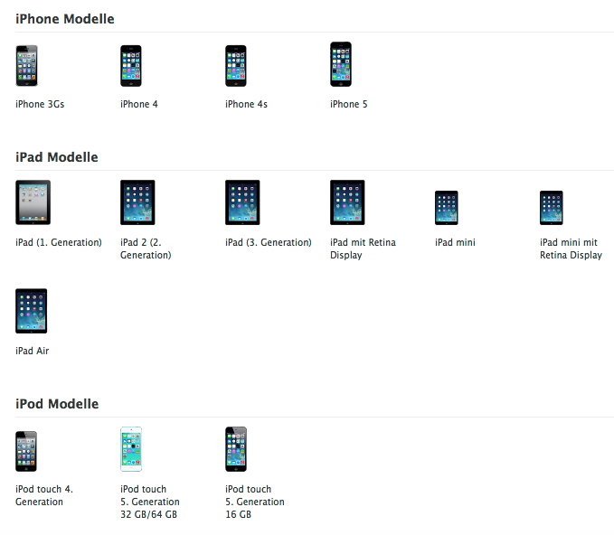
```

## Nutzung des Internets

Alltägliche Datenmengen: Zahlen und Beispiele

```{r fig.cap="tägliche Nutzung der User"}
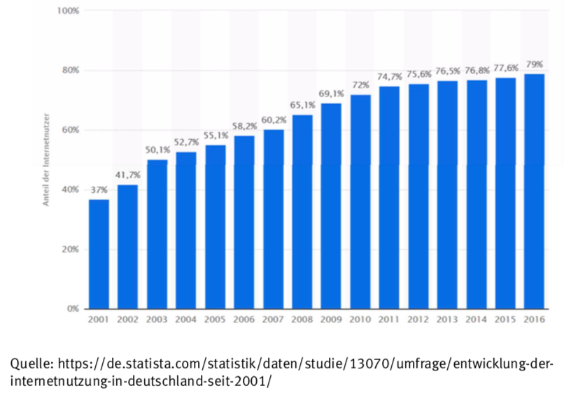
```

```{r fig.cap="tägliche Nutzung der User"}
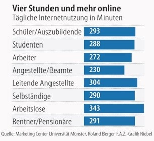
```

```{r fig.cap="tägliche Nutzung der User"}
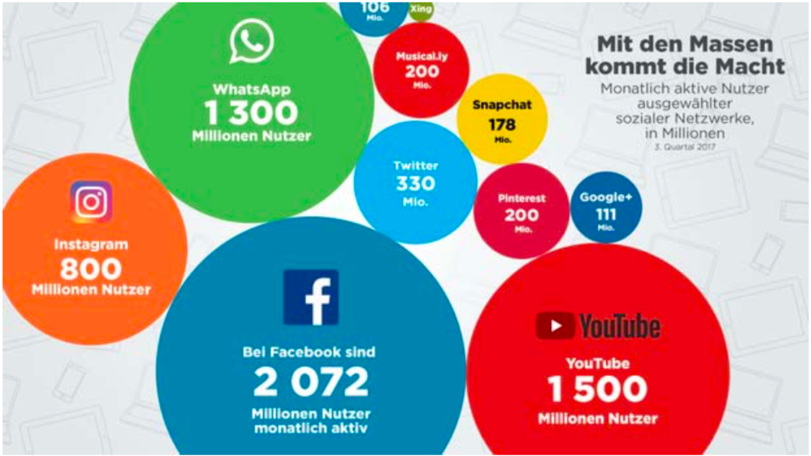
```

```{r fig.cap="Entwicklung der Datenmenge im Internet"}
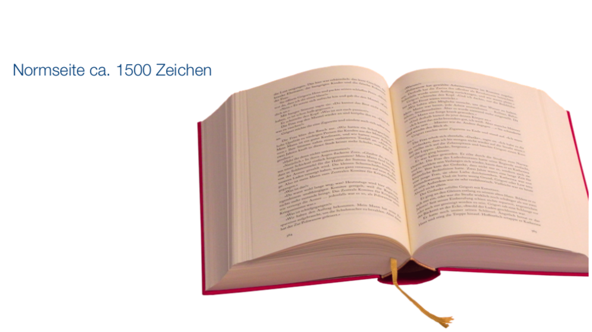
```

```{r fig.cap="Entwicklung der Datenmenge im Internet"}
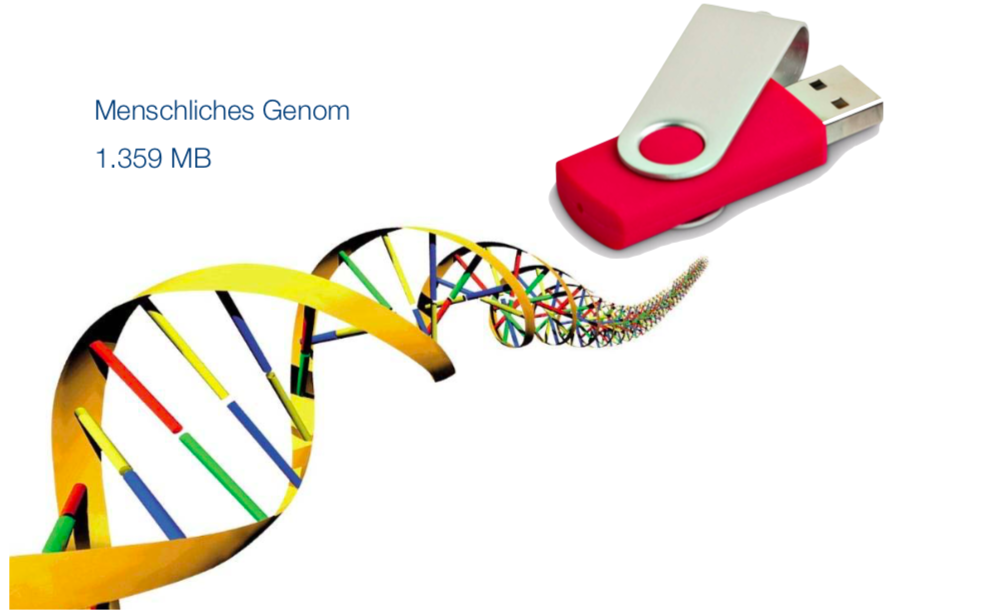
```

```{r fig.cap="Entwicklung der Datenmenge im Internet"}
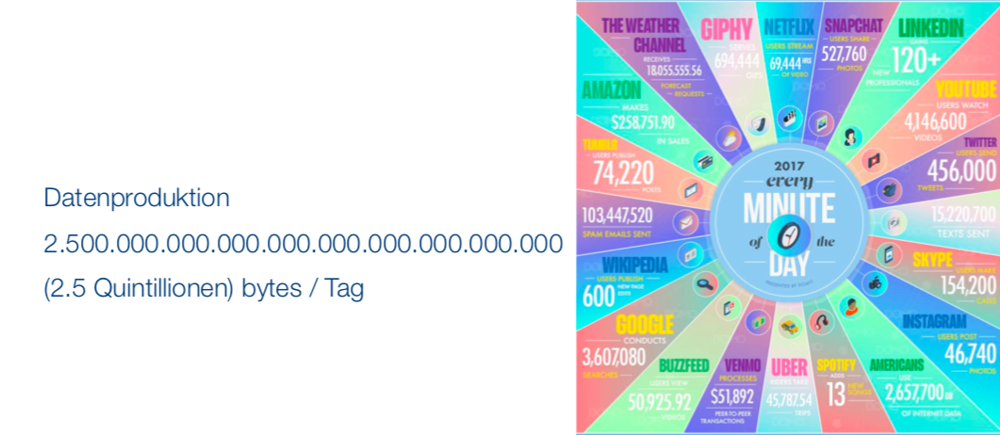
```

```{r fig.cap="Entwicklung der Datenmenge im Internet"}
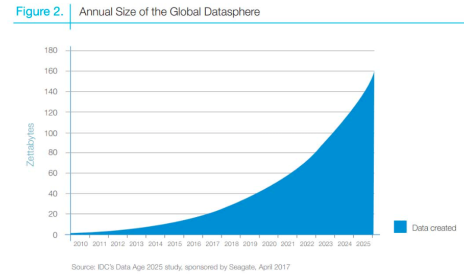
```

## Daten im Internet
BIG DATA: die fünf V's

```{r fig.cap="BIG DATA: die fünf V's"}
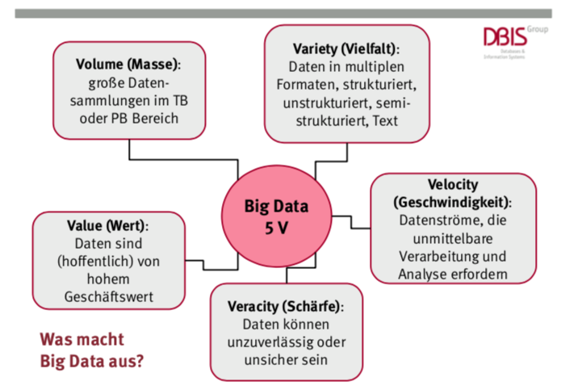
```

Welche Art von Daten werden genutzt?: strukturierte und unstrukturierte Daten

```{r}
knitr::kable(mtcars[1:3, ], caption = "Strukturierte Daten")
```

```{r fig.cap="Unstrukturierte Daten"}

```

# Ziele

## Nutzung von Daten
Data Science: Beherrschung und Nutzbarmachung der Daten

```{r fig.cap="BIG DATA: die fünf V's"}

```

Beispiel: Progresstest

```{r fig.cap="Analyse der Progresstest-Daten nach Alter"}
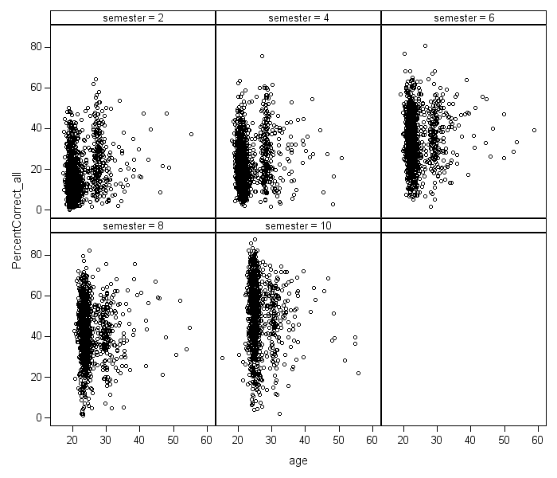
```

# Brainstorming

