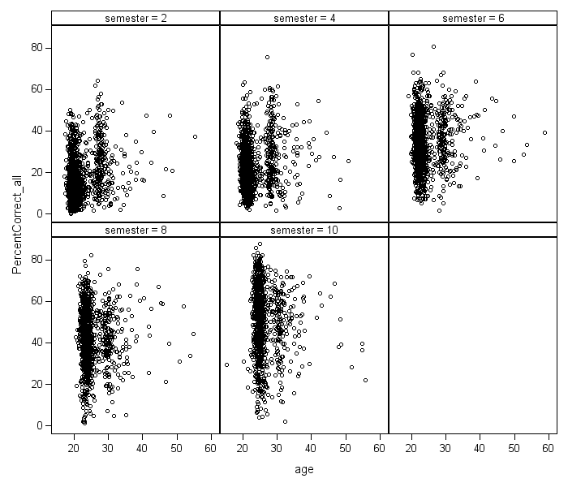

```{r setup, include=FALSE}
knitr::opts_chunk$set(echo = FALSE, eval = FALSE)
library(tufte)
# Umwandlung in Powerpoint-Datei über rmarkdown::render("Spieglein_article.Rmd", output_format = "powerpoint_presentation", output_options = list(reference_doc = "my-styles.pptx"))
# Umwandlung in Tufte-Handout über rmarkdown::render("Spieglein_article.Rmd", output_format = "tufte_handout")
# Umwandlung in Word-Datei über rmarkdown::render("Spieglein_article.Rmd", output_format = "word_document")
```
# Hintergrund

## Social Media

Alltägliche Datenmengen: Zahlen und Beispiele

```{r fig.cap="Tägliche Nutzung der User"}
knitr::include_graphics("images/vier-stunden-und-mehr-online.jpg")
```

```{r fig.cap="Die großen Player"}
knitr::include_graphics("images/Nutzer_social_Media.png")
```


# Ziele

## Data Science in Social Media

```{r fig.cap="FAANG: Facebook - Apple - Amazon - Netflix - Google (Alphabet)"}

```

Milliardäre in Not: Das Platzen der Dotcom-Blase

```{r fig.cap="Das Platzen der Dotcom-Blase 2000"}

```

```{r fig.cap="FAANG - Entwicklung der Aktienkurse"}
knitr::include_graphics("images/FAANG-Stocks.png")
```

Was machen die mit unseren Daten?: der Verhaltensüberschuss

```{r fig.cap="Abschöpfen von Nutzerdaten"}

```

## Verhaltensüberschuss
Es fing ganz einfach an ...

```{r fig.cap="Treffsicherheit von Nutzer-Eigenschaften durch Verhaltensweisen im Internet"}

# Prediction accuracy of classification for dichotomous/dichotomized attributes expressed by the AUC.
```

... und wurde komplexer

### Persönlichkeit
BIG FIVE: Fünf Hauptdimensionen der Persönlichkeit

* Offenheit (Wie aufgeschlossen sind Sie gegenüber Neuem?)

* Gewissenhaftigkeit (Wie perfektionistisch sind Sie?)

* Extraversion (Wie gesellig sind Sie?)

* Verträglichkeit (Wie rücksichtsvoll und kooperativ sind Sie?)

* Neurotizismus (Sind Sie leicht verletzlich?)

### Fragebogen BIG FIVE
```{r fig.cap="Treffsicherheit von Nutzer-Eigenschaften durch Verhaltensweisen im Internet"}
knitr::include_graphics("images/Kurzfragebogen_BIG_FIVE.png")
```

### Wie gut kennen mich ...?
<aside>
```{r fig.cap="Treffsicherheit von Nutzer-Eigenschaften durch Verhaltensweisen im Internet"}

```
</aside>

* meine Eltern

* meine Arbeitskollegen

* mein/e Vorgesetzte/r

* mein/e Mitarbeiter/in

* mein/e Mitbewohner/in

* mein/e beste/r Freund/in

* ein/e enge/r Bekannte/r

* ein/e Schulfreund/in

* meine Geschwister

* mein/e Ehe/Lebenspartner/in

* ein/e Fremde/r

* eine gelegentliche Bekanntschaft

### Wie gut kennen mich Facebook & Co.?

```{r fig.cap="Korrelation von Facebook-Likes mit Persönlichkeit"}

# Computer-based personality judgment accuracy (y axis), plotted against the number of Likes available for prediction (x axis). The red line represents the average accuracy (correlation) of computers’ judgment across the five personality traits. The five-trait average accuracy of human judgments is positioned onto the computer accuracy curve. For example, the accuracy of an average human individual (r = 0.49) is matched by that of the computer models based on around 90–100 Likes. The computer accuracy curves are smoothed using a LOWESS approach. The gray ribbon represents the 95% CI. Accuracy was averaged using Fisher’s r-to-z transformation.
```

# Brainstorming
denn sie wissen, was sie tun ...

* Dark Google? (S. Zuboff)


