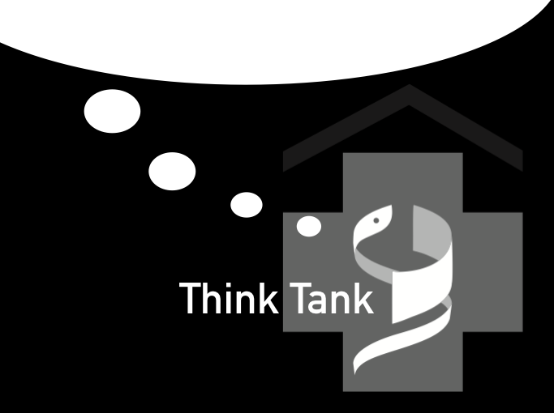

```{r setup, include=FALSE}
knitr::opts_chunk$set(echo = FALSE)
library(icon)
```

Die Veranstaltung findet (nach aktuellem Stand) immer donnerstags, 14.00 c.t. statt und dauert ca. 30 Minuten. Voraussichtlich werden wir uns im 1. Seminarraum im OG des Studienhospitals (\@ref(fig:mapSHM)) treffen können. Bitte achtet auf entsprechende Aushänge.

<aside>
```{r}

```
</aside>

<aside>
Das Logo des Think Tank
</aside>

# Neue Termine für 2019

## BIG-DATA-Serie

__10.01.2019__: Wer viel misst, misst viel Mist, oder? – was ist "BIG" an BIG DATA?

__17.01.2019__: "Spieglein, Spieglein an der Wand, sag' mir wer ..." – wie gut kennen mich Facebook & Co.?

__24.01.2019__:	Schachmatt: Machine Learning, Deep Learning und die Frage der (künstlichen) Intelligenz

__31.01.2019__: Zu gut für die Medizin? – BIG DATA im Gesundheitswesen


## Veranstaltungsort

Der Think Tank findet im Studienhospital Münster (Malmedyweg 17-19, Münster) statt.
Bitte achten Sie auf die entsprechenden Aushänge am Eingang.

## Website

Die vorliegende Website wurde mit der Open-Source-Software RADIX erstellt.

```{r mapSHM, fig.cap="Veranstaltungsort", layout="l-body shaded"}
library(leaflet)
leaflet() %>%
  addTiles() %>%  # Add default OpenStreetMap map tiles
  addMarkers(lng=7.60105, lat=51.95740, popup="Studienhospital Münster") %>%
  setView(lng=7.60105, lat=51.95740, zoom=17)
```

## Acknowledgments {.appendix}

Diese Website ist mit RADIX-Open-Source-Software entstanden.

## Author Contributions {.appendix}

Hier kann jede/r einen Beitrag leisten: Wenn Ihr eine Idee für ein Thema oder einen Vortrag habt, bitte einfach bei mir melden!